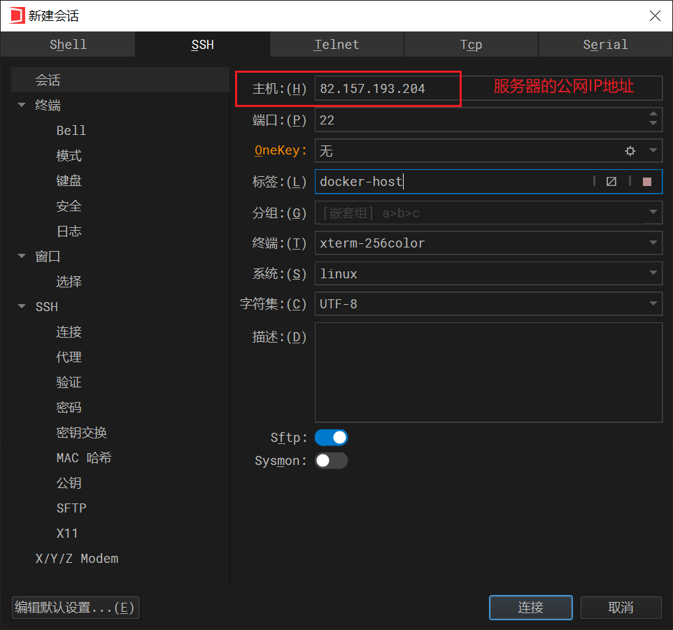

# Docker教程

## I Docker基础

### 1.1 为什么有Docker？

1、Docker：

- 只需要一行代码**跨平台快速运行应用**。
- 把软件打包成一个软件包，**快速构建应用**。
- 把自己做的软件发布到Docker Hub，达到**快速分享应用**。别人可以从Docker Hub下载应用。(软件发布到Docker Hub，就叫做**镜像**)

2、What is Docker？

- Accelerate how you **build** (打包), **share** (发布), and **run** (运行)applications.

### 1.2 Docker架构与容器化

1、Docker的工作：Build、Share、Run。

- 已经安装Docker的机器叫Docker主机或Docker Host。
- Docker Daemon为一直在后台运行的进程，为用户提供服务。
- Client(docker-cli)：为命令行程序，驱动/操纵Docker Daemon进程提供服务。
- Images：镜像(软件包)，镜像启动的应用叫容器(Containers)，**容器为运行中的应用**。


2、部署：

- 传统部署：如果一个应用出现内存泄漏，会占用其他应用的空间。
- 虚拟化部署：传统部署的改进，将每个应用部署在各自的虚拟机，不影响其他虚拟机的应用，但是每个虚拟机有各自的OS，会显得很笨重。
- 容器部署：每个应用运行在自己的Container中，容器中有应用可以运行的完整环境，容器之间互相隔离。(跨平台：只要安装了容器运行时环境，即可运行容器)。


### 1.3 Docker安装

1、开通云服务器：

- 使用腾讯云，便宜，按量计费。
- 控制台 -> 云服务器 -> 按量计费 -> CentOS7.9 -> 分配独立公网IP(用于连接互联网以及远程访问) -> 按流量计费 -> 安全组(服务器的防火墙，要开放一些端口供远程访问) -> 设置密码。


- 使用WindowsTerminal交互，是一款类似于Linux的功能的终端。




- 关机时选择关机不收费选项，但是公网IP将会释放，再次使用时刷新就好。

2、在云服务器/虚拟机安装Docker：

- Docker教程：[Manuals | Docker Docs](https://docs.docker.com/manuals/)
- Manual -> Docker Engine -> CentOS -> 安装命令安装即可。
- Uninstall old versions。

```
sudo yum remove docker \
                  docker-client \
                  docker-client-latest \
                  docker-common \
                  docker-latest \
                  docker-latest-logrotate \
                  docker-logrotate \
                  docker-engine
```

- 安装yum工具类，通过yum配置Docker。

```
sudo yum install -y yum-utils
sudo yum-config-manager \
--add-repo \
http://mirrors.aliyun.com/docker-ce/linux/centos/docker-ce.repo
```

- 安装Docker引擎。`docker-ce` 为Docker引擎，`docker-ce-cli` 为Docker引擎的命令行程序。

```
sudo yum install docker-ce docker-ce-cli containerd.io docker-buildx-plugin docker-compose-plugin
```

- 启动Docker。

```
sudo systemctl start docker
```

- 查看运行中的应用。

```
docker ps
```


- 开机时自动启动Docker。

```
systemctl enable docker
```

- 配置加速：使用国内镜像源。修改Docker的配置文件。

```
# 配置加速
sudo mkdir -p /etc/docker
sudo tee /etc/docker/daemon.json <<-'EOF'
{
    "registry-mirrors": [
        "https://registry.dockermirror.com"
    ]
}
EOF
sudo systemctl daemon-reload
sudo systemctl restart docker
```

## II Docker命令

1、任务：启动一个nginx，并将它的首页改为自己的页面，发布出去，让所有人都能使用。

- 下载nginx镜像。
- 启动容器。
- 修改页面。
- 保存镜像。
- 分享社区。

2、下载nginx镜像：

- `docker search xxx` 检索镜像看docker hub中是否所检索的镜像。此处需要外网检索，不能用国内镜像。
  - DESCRIPTION：镜像的描述。
  - STARS：镜像的stars。
  - OFFICIAL：是否为官方发布。


- `docker pull xxx` 下载镜像。
- `docker images` 检查安装的镜像 列表。
  - TAG：latest 为最新版本。
  - CREATED：2 weeks ago 被创建。
  - SIZE：镜像大小。


- 镜像名的完整格式：镜像名:标签(版本) 如 `nginx:1.26.0` 或 `nginx:latest` 。
- https://hub.docker.com/ 在dockerhub上查找镜像的完整名字(名字 + 标签)。


- 删除镜像：rmi 为 remove image
  - 操作1：`docker rmi IMAGE ID` 。
  - 操作2：`docker rmi name:tag(version)` 。


3、启动容器：

- 容器，为运行中的应用。
- `docker run` 运行。
  - `docker run --help` 查看命令如何使用。
  - 如果停止Console，将会使得运行的nginx停止运行。所以，使用重启视图查看运行的应用。


- `docker ps` 查看正在运行中的应用。
  - 可以看到刚才启动的nginx正在运行，STATUS为Up表示成功，NAMES自动为容器起名。

.png)

- 打断 (Ctrl + C) 后，再使用 `docker ps` 查看后，发现运行中的容器为空。


- `docker ps -a` 查看所有包括曾经运行但现在关闭的容器。


- `docker stop xxx` 停止。
- `docker start xxx` 启动。
- `docker restart xxx` 重启。
  - `xxx` 可以为NAME或容器的唯一ID，并且为可以区分的前缀名即可，不用写全。


- `docker stats xxx` 。查看状态，包括CPU、IO、内存等占用情况。


- `docker logs xxx` 。查看日志。


- `docker rm` 删除，强制删除(可以删除在运行中的容器) `docker rm -f xxx` 。 rm删除容器 rmi删除镜像。


- `docker run nginx` 是控制台阻塞行为，必须Ctrl + C才能停止，并且停止后容器也停止。如何才能使得nginx可以启动后在后台默默运行以及在浏览器打开这个容器，见后文。

4、`docker run` 细节：

- `-d` 参数：后台启动。
- `--name xxx` 参数：自己命名，不需要系统随机命名。
- `-p 外部端口 内部端口` 参数：端口映射，在主机外访问其中的容器。
  - 88不能重复，因为主机只有一个88端口。80可以重复，因为容器1有80端口，容器2也有80端口。容器像一个小的Linux系统。


5、进入nginx容器修改页面：

- `docker exec xxx` ：进入容器。


- `docker exec -it mynginx /bin/bash` ：
  - `-it` ：交互模式。
  - `/bin/bash` ：具体访问形式。


- 当想要通过vi方式修改 index.html页面时，发现 `vi command not found` ，是因为容器非常轻量，不存在 `vi command` 。通过 `echo` 方式输出。


- 后续为便于修改和显示，通过docker存储，将内部的文件夹映射到外部主机的文件夹。

5、保存镜像：

- `docker commit xxx` ：容器 -> 镜像


- `docker save xxx`  ：镜像 -> tar包


- `docker load xxx` ：加载命令，将tar包加载为一个镜像。Load an image from a tar archive.


==**6、分享镜像：需要将服务器连接外网 未做**==

## III Docker存储

1、目录挂载：

- 内部：`/usr/share/nginx/html` <-> 外部：`/app/nghtml` 。二者保持同步，外部内容和内部内容保持一致。
- 命令：`docker run -v /app/nghtml:/usr/share/nginx/html` 。


- 此时外界访问将会403，因为外部的/app/nghtml目录下为空。


- 在外部文件夹建立index.html。


- 在内部修改：


2、卷映射：

- 首先，使用目录挂载的方式做配置文件的映射，会出现问题，显示容器的状态为Exit。原因是目录挂载的初始化为内外目录均为空，但是配置文件为空的话启动容器有问题。所以做配置文件(configuration)的映射不能用目录挂载，而要用卷映射。除非提前把配置文件放到空目录中，所以目录挂载做配置文件的映射行不通。


- nginx的配置文件在：`/etc/nginx` 。卷映射可以保证初始化时的内容不空，外部与内部保持一致。卷(卷名任意，不是目录层级的形式，如卷名为 `ngconf`)会被存储到外部的 `/var/lib/docker/volumes/<volume-name>` 下。
- 此时做卷映射后的配置文件目录不为空。


- 在外部修改配置文件，登录内部容器查看修改内容。


- 目录挂载：初始时外部与内部目录都为空；卷映射：**外部目录要以内部为准，所以不会空**。
- `docker volume xxx` 命令对卷的操作。


- 同时删除容器后，在外部的卷 `ngconf` 等内容同时保留。所以再次启动时，仍可以做卷映射。


3、服务器的安全组：

- 是一种虚拟防火墙，用于设置单个或多个云服务器的网络访问控制。
- 用户可以为安全组制定一系列规则，这些规则定义了允许或拒绝流入和流出云服务器的数据报的类型。可以限制或允许特定的IP地址或IP地址范围、特定端口号和协议访问云服务器。


## IV Docker网络

1、Docker网络：容器A内访问容器B内的数据。


- 访问方式1：进入容器A内，`curl 机器IP:容器B端口` 。


- 访问方式2：利用网关(GateWay) docker0。

  - docker为每个容器分配唯一IP，使用**容器IP + 容器端口**可以互相访问。
  - docker在启动时，默认创建网络docker0 -> Gateway。

  

  - docker 在启动每个应用时，都会加入到docker0中。
  - `docker inspect app1` ，容器 `app1` 的默认网关是 `172.17.0.1` ，即 `docker 0` 。

  

  - 容器 `app1` ，容器 `app2` 和网关 `docker 0` 之间的拓扑：

  

  - 进入容器 `app1` ，访问容器 `app2` ，要使用 `app2` 的端口 `80` ，而不是机器的端口。

  

  - 缺点：IP由于各种原因可能会变化，如关机重启。所以为了稳定访问，可以创建自定义网络，让容器加入网络后，**容器名就是稳定域名**。**docker 0** 不支持主机域名，所以后续要进行自定义网络，要删除容器 `app1` 和 `app2` 。
  
  
  
  - 创建网络 `mynet` ：
  
  
  
  - 运行容器 `app1` 和 `app2` ：使用自定义网络 `mynet` 。
  
  
  
  - 直接使用容器名访问：
  
  
